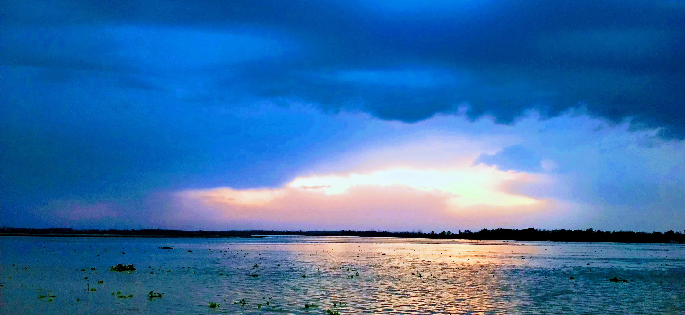

# About Me :india:

:wave: folks! Allow me to introduce myself :smile: 

## Personal life :house_with_garden: 
```text
My name is Vaibhav, I'm a self-taught software developer
based out of a small magical city in Northern, India
known as Bijnor. Let me share a picture of my place.
```



```text
See it is magical I told ya apart from helping companies
build robust and scalable web apps I love biking,
trekking, watching movies, etc
```

## Professional life :briefcase:
```text
I have been working as a software developer for more than
7 years and during this time, I have served on various 
capacities from software developer to co-founder for 
startups to MNCs in various industrial verticals such as
 
    • Agriculture
    • Banking
    • Education
    • Food industry
    • Insurance
    • Telecommunications, etc

I help them in design, development, execution, and
scaling from idea to launch.
```

[![alt text][1.1]][1]
[![alt text][2.1]][2]
[![alt text][3.1]][3]

[1.1]: /assets/img/linkedin.png
[2.1]: /assets/img/github.png
[3.1]: /assets/img/twitter.png

[1]: https://www.linkedin.com/in/iamvaibhavjain/
[2]: https://github.com/vaibhav-jain 
[3]: https://twitter.com/JaIn10VaIbHaV
